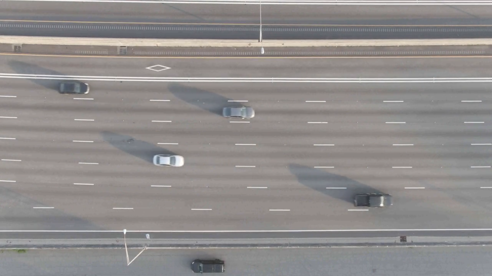
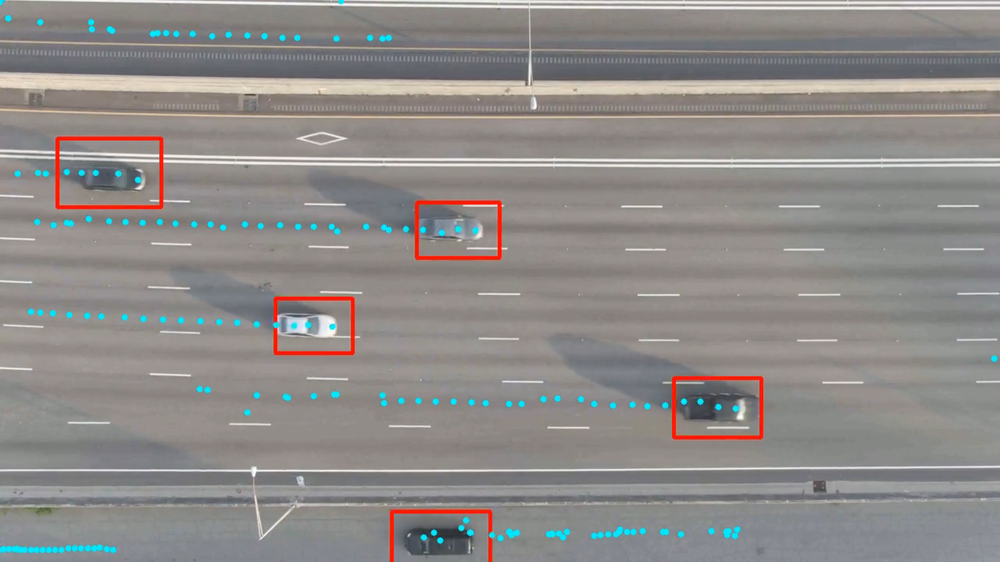

# video_analytics_detectors

## Технологии и ограничения:
- Языки программирования:
  - Java
  - Python
  - C++;
- Дополнительные библиотеки:
  - OpenCV;

## Постановка задачи:
1. Реализовать программный модуль опроса видеокамеры. Для теста можно использовать видеокамеру Axis 214  192.168.217.103. При этом допускается использование библиотеки Opencv.
2. Разработать два варианта детектора движения для выделения объектов переднего плана:
    - детектор движения с использование функционала библиотеки opencv;
    - детектор движения без использования сторонних библиотек;
3. С помощью оптического потока разработать модуль сопровождения (трекинга) объекта, выделенного при реализации п.2. При этом отобразить сглаженную траекторию движения объекта.

## Общие требования по выполнению:
1. Код должен быть написан понятно и аккуратно, с соблюдением табуляции и прочих элементов написания, без лишних элементов и функций, не имеющих отношения к функционалу тестового задания, снабжен понятными комментариями.
2. Чистота и оформление кода — не менее важный фактор. Код должен быть написан в едином стиле (желательно в рекомендуемом для конкретного языка). Также к чистоте относятся отсутствие копипаста и дублирования логики.
3. Исходные коды должны быть в Git. Желательно делать частые информативные коммиты, активно использовать ветки.
4. Должна быть инструкция по сборке и разворачиванию, а также должен быть описан порядок развертывания и запуска проекта в среде разработки (включая настройку БД, дамп схемы БД, настройку сервера приложения для запуска и т.д.)
5. Сервисы (серверная часть) должны быть максимально покрыты модульными тестами
6. Интерфейс должен отвечать требованиям usability

## Зависимости
Единственной зависимостью является библиотека OpenCV. OpenCV (Open Source Computer Vision Library) - это библиотека
с открытым исходным кодом, предназначенная для компьютерного зрения и обработки изображений. Она предоставляет 
богатый набор функций и инструментов для анализа, обработки и манипулирования изображениями и видео в реальном времени.
#### Установка под Linux:
```shell
sudo apt-get install libopencv-dev
```
Необходимо заранее установить CMake и OpenCV перед сборкой проекта.
```shell
mkdir build
cd build
cmake ..
make
```
## Запуск
Для запуска необходимо запустить исполняемый файл build/video_analytics_detector.
## Пример работы программы
#### Оригинальное видео

#### Выходное видео

